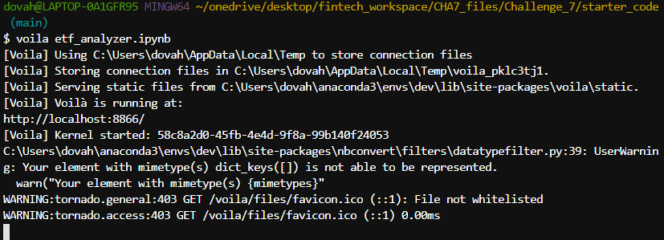
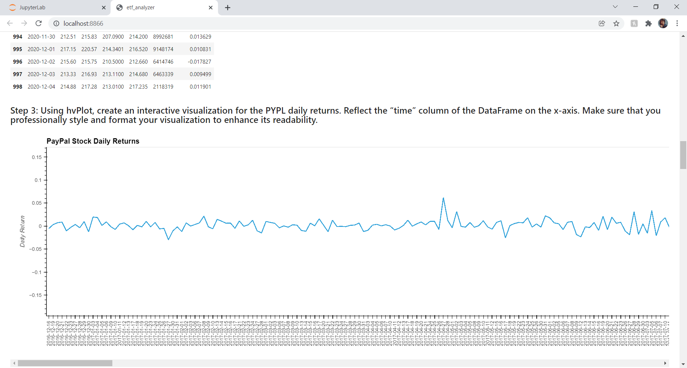
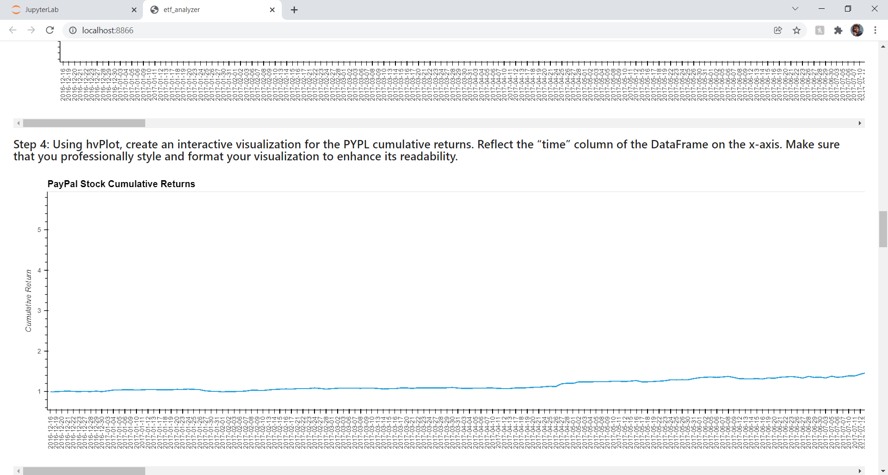
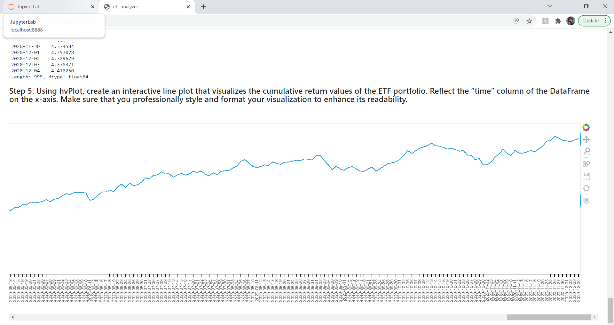

# ETF Analysis with SQL and Viewing it Using Voila

This Jupyter notebook is meant to demonstrate the concept of passive investing with ETFs, and it specifically uses SQL dialect and the voila library to do so.
This Jupyter notebook contains: the resulting data of the analysis of one of the assets in the ETF, optimized access of a database using advanced SQL queries, and the analysis of the full portfolio's returns. It's all then able to be made viewable as a webpage that runs off the local system using the Voila library.

---

## Technologies

### Libraries:
* Pandas
* hvplot.pandas
* NumPy
* SQLAlchemy
* Voila

The language of this application is Python on the Anaconda developement environment, used on Jupyter Lab. The libraries used that come with Python are Pandas, NumPy, and SQLAlchemy. To use hvplot, it must be installed as a PyViz package along with GeoViews. To use Voila, it must also be installed to the conda environment as like HvPlot, Anaconda does come with it.

---

## Installation Guide

To install HvPlot with GeoViews, enter `conda install -c pyviz hvplot geoviews` to the terminal. Enter `conda list hvplot` after that and `conda list geoviews` second to confirm installation of both.
To install Voila, enter `conda install -c conda-forge voila` to the terminal. Enter `conda list voila` after to confirm the installation.

---

## Usage

#### How the webpage is generated from the terminal once inside the directory of the notebook being launched:

#### A few examples of how the visual analyses appear in the viewable webpage of this notebook:

All info is already input and worked on within the Jupyter file. Simply start from the top and go down the page to view relevant data, calculations, analysis, and notes. Most notes are written as Markdown text. Data within the notebook can also be viewed on the voila webpage when it's running.

---

## Contributor

Isaiah T Tensae